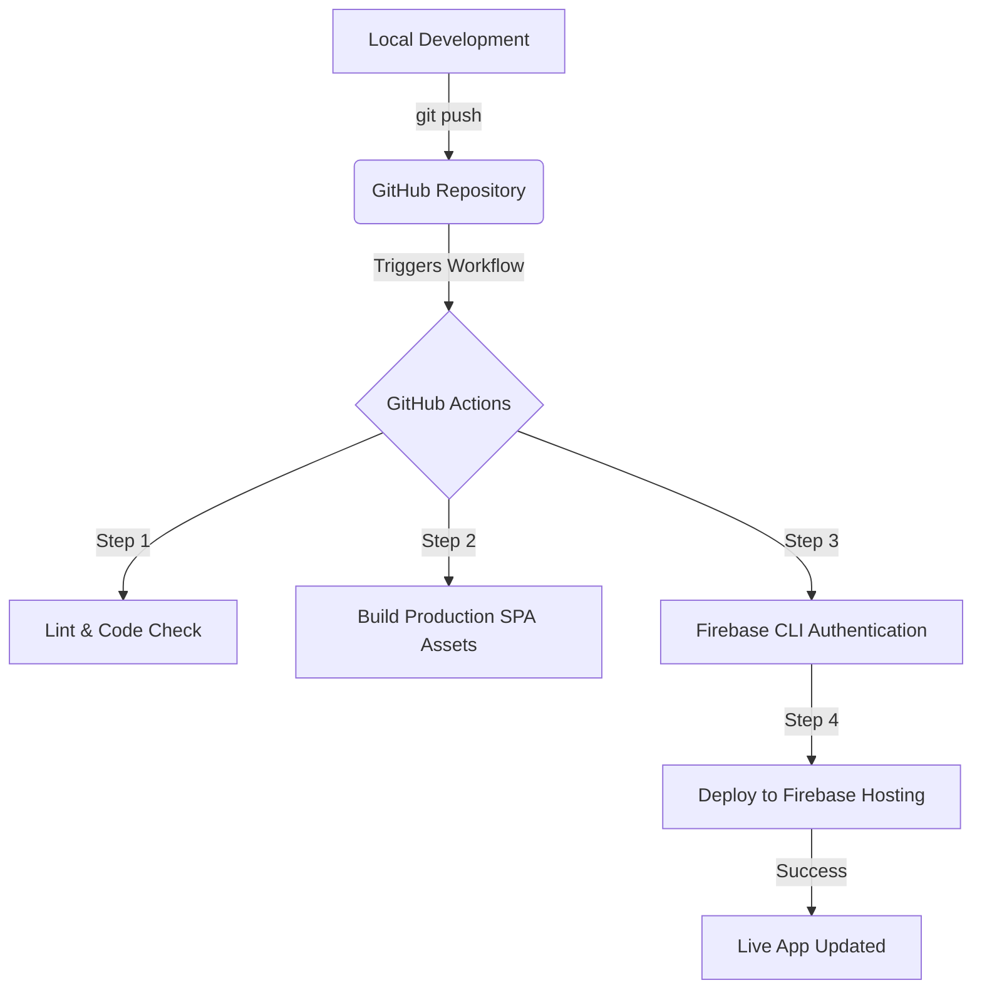

# 🛠️ Tech Stack

Since the system operates entirely without a custom backend, the entire application logic, state calculation, and file generation (Excel exports) happen securely on the client side, leveraging Firebase's managed services.

## Core Stack Components

| Layer              | Technology              | Justification & Role                                                                                                                                                                   |
| ------------------ | ----------------------- | -------------------------------------------------------------------------------------------------------------------------------------------------------------------------------------- |
| Frontend Framework | React (via Vite)        | Provides a highly responsive, component-based environment ideal for interactive dashboards. Vite ensures the bundle remains minimal, fast, and mobile-friendly.                        |
| Styling & UI       | Tailwind CSS            | Utility-first CSS framework that makes building a fully responsive, mobile-first design incredibly straightforward with minimal footprint.                                             |
| Database           | Cloud Firestore         | A flexible NoSQL document database. It allows real-time synchronization for tenant dashboards and handles hierarchical structures like tracking expenses nested under specific months. |
| Authentication     | Firebase Authentication | Manages secure sign-ins (Email/Password) and provides JWT tokens containing custom user claims (Admin vs. Tenant roles).                                                               |
| Hosting            | Firebase Hosting        | Production-grade, secure, and globally distributed SSD hosting to serve the static SPA assets with instant rollbacks.                                                                  |
| Client Utilities   | SheetJS (`xlsx`)        | Handles the generation and download of Excel spreadsheets directly within the user's browser, eliminating the need for a backend Excel generator.                                      |

---

# 🚀 Deployment Flow (CI/CD Pipeline)

The deployment pipeline automates production updates every time code is safely merged into your repository's primary branch.

## Deployment Architecture



## Step-by-Step CI/CD Automation Engine

### 1. Code Integration

Developers merge a pull request or push code directly to the `main` or production branch on GitHub.

### 2. Workflow Trigger

A GitHub Actions runner initializes a clean virtual environment (e.g., `ubuntu-latest`) using Node.js environment specifications matching the local development setup.

### 3. Build & Optimization

The runner installs client-side dependencies using:

```bash
npm ci
```

Then executes:

```bash
npm run build
```

This compiles, minifies, and optimizes all JavaScript, CSS, and asset files into a highly compressed static distribution directory (`/dist` or `/build`).

### 4. Authorization & Transfer

Utilizing an encrypted Firebase Service Account Token stored safely within GitHub Secrets, the runner authorizes a direct connection to your Firebase project.

The workflow then triggers the Firebase CLI to upload the optimized assets directly to Firebase Hosting servers, instantly switching traffic over to the newest deployment.

---

# ⚙️ Configuration Blueprints

## 1. GitHub Actions CI/CD Configuration

Create the following file:

```text
.github/workflows/firebase-deploy.yml
```

```yaml
name: Deploy to Firebase Hosting

on:
  push:
    branches:
      - main

jobs:
  build_and_deploy:
    runs-on: ubuntu-latest

    steps:
      - name: Checkout Repository
        uses: actions/checkout@v4

      - name: Set up Node.js
        uses: actions/setup-node@v4
        with:
          node-version: 20
          cache: npm

      - name: Install Dependencies
        run: npm ci

      - name: Build Application
        run: npm run build
        env:
          VITE_FIREBASE_API_KEY: ${{ secrets.FIREBASE_API_KEY }}
          VITE_FIREBASE_AUTH_DOMAIN: ${{ secrets.FIREBASE_AUTH_DOMAIN }}
          VITE_FIREBASE_PROJECT_ID: ${{ secrets.FIREBASE_PROJECT_ID }}

      - name: Deploy to Firebase Hosting
        uses: FirebaseExtended/action-hosting-deploy@v0
        with:
          repoToken: ${{ secrets.GITHUB_TOKEN }}
          firebaseServiceAccount: ${{ secrets.FIREBASE_SERVICE_ACCOUNT_TENANTTRACK }}
          channelId: live
          projectId: tenanttrack
```

---

## 2. Firebase Project Manifest

Create a `firebase.json` file in the root directory:

```json
{
  "hosting": {
    "public": "dist",
    "ignore": [
      "firebase.json",
      "**/.*",
      "**/node_modules/**"
    ],
    "rewrites": [
      {
        "source": "**",
        "destination": "/index.html"
      }
    ]
  }
}
```

This configuration ensures Firebase Hosting routes all incoming URLs through `index.html`, allowing React Router (or any SPA router) to manage navigation correctly.

---

# 🔒 Security & Access Control Model

Because there is no traditional backend application server to protect the database, security must be enforced directly at the Firebase cloud infrastructure level.

## Role Enforcement

When an account is designated as an Administrator, a Firebase Cloud Function (or manual initialization script) applies a custom claim:

```json
{
  "admin": true
}
```

This claim becomes part of the authenticated user's JWT token and is available inside Firestore Security Rules.

## Firestore Security Rules

The database denies all unauthorized access by default.

### Read Operations

Allowed only for authenticated users whose account matches a registered tenant profile.

### Write Operations

Granted strictly when:

```javascript
request.auth.token.admin == true
```

This ensures that only authorized administrators can create, update, or delete records while tenants retain read-only access where appropriate.

### Security Principles

* Default-deny access model.
* Authentication required for all protected resources.
* Role-based authorization enforced through Firebase Custom Claims.
* Firestore rules act as the primary security boundary.
* No sensitive business logic is exposed through a custom backend server.
* All communication occurs over HTTPS using Firebase-managed infrastructure.
