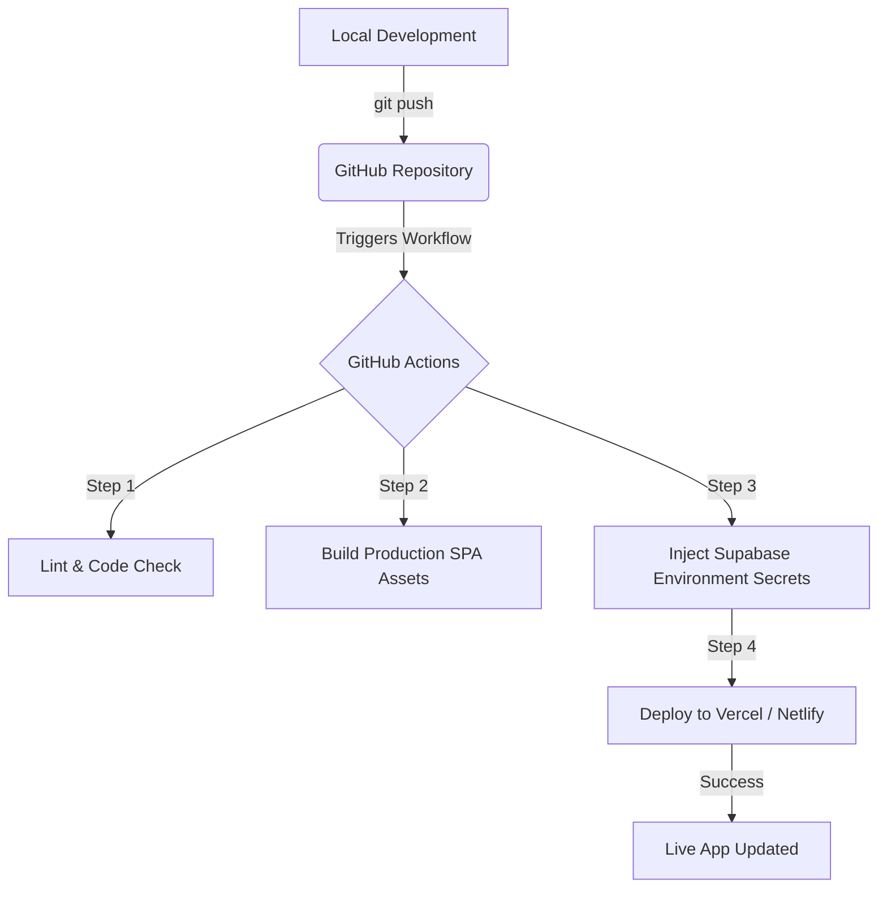

# 🛠️ Tech Stack

Since the system operates entirely without a custom backend, the entire application logic, state calculation, and file generation (Excel exports) happen securely on the client side, leveraging Supabase's managed services.

## Core Stack Components

| Layer              | Technology              | Justification & Role                                                                                                                                                                   |
| ------------------ | ----------------------- | -------------------------------------------------------------------------------------------------------------------------------------------------------------------------------------- |
| Frontend Framework | React (via Vite)        | Provides a highly responsive, component-based environment ideal for interactive dashboards. Vite ensures the bundle remains minimal, fast, and mobile-friendly.                        |
| Styling & UI       | Tailwind CSS            | Utility-first CSS framework that makes building a fully responsive, mobile-first design incredibly straightforward with minimal footprint.                                             |
| Database           | Supabase (PostgreSQL)   | A fully managed relational database built on PostgreSQL. It supports real-time subscriptions for tenant dashboards and structured querying for hierarchical data like expenses nested under specific months. |
| Authentication     | Supabase Auth           | Manages secure sign-ins (Email/Password) and provides JWT tokens containing custom user metadata (Admin vs. Tenant roles) via Row-Level Security policies.                             |
| Hosting            | Vercel / Netlify        | Production-grade, secure, and globally distributed hosting to serve the static SPA assets with instant rollbacks and preview deployments per branch.                                   |
| Client Utilities   | SheetJS (`xlsx`)        | Handles the generation and download of Excel spreadsheets directly within the user's browser, eliminating the need for a backend Excel generator.                                      |

---

# 🚀 Deployment Flow (CI/CD Pipeline)

The deployment pipeline automates production updates every time code is safely merged into your repository's primary branch.

## Deployment Architecture



## Step-by-Step CI/CD Automation Engine

### 1. Code Integration

Developers merge a pull request or push code directly to the `main` or production branch on GitHub.

### 2. Workflow Trigger

A GitHub Actions runner initializes a clean virtual environment (e.g., `ubuntu-latest`) using Node.js environment specifications matching the local development setup.

### 3. Build & Optimization

The runner installs client-side dependencies using:

```bash
npm ci
```

Then executes:

```bash
npm run build
```

This compiles, minifies, and optimizes all JavaScript, CSS, and asset files into a highly compressed static distribution directory (`/dist` or `/build`).

### 4. Authorization & Transfer

Utilizing encrypted Supabase credentials (Project URL and Anon Key) stored safely within GitHub Secrets, the runner injects these as environment variables at build time.

The workflow then triggers the hosting provider CLI (Vercel or Netlify) to upload the optimized assets directly to the CDN edge network, instantly switching traffic over to the newest deployment.

---

# ⚙️ Configuration Blueprints

## 1. GitHub Actions CI/CD Configuration

Create the following file:

```text
.github/workflows/deploy.yml
```

```yaml
name: Deploy to Vercel

on:
  push:
    branches:
      - main

jobs:
  build_and_deploy:
    runs-on: ubuntu-latest

    steps:
      - name: Checkout Repository
        uses: actions/checkout@v4

      - name: Set up Node.js
        uses: actions/setup-node@v4
        with:
          node-version: 20
          cache: npm

      - name: Install Dependencies
        run: npm ci

      - name: Build Application
        run: npm run build
        env:
          VITE_SUPABASE_URL: ${{ secrets.SUPABASE_URL }}
          VITE_SUPABASE_ANON_KEY: ${{ secrets.SUPABASE_ANON_KEY }}

      - name: Deploy to Vercel
        uses: amondnet/vercel-action@v25
        with:
          vercel-token: ${{ secrets.VERCEL_TOKEN }}
          vercel-org-id: ${{ secrets.VERCEL_ORG_ID }}
          vercel-project-id: ${{ secrets.VERCEL_PROJECT_ID }}
          vercel-args: '--prod'
```

---

## 2. Supabase Environment Configuration

Create a `.env.local` file in the root directory (never commit this to version control):

```env
VITE_SUPABASE_URL=https://your-project-ref.supabase.co
VITE_SUPABASE_ANON_KEY=your-anon-key-here
```

Initialize the Supabase client in your application:

```typescript
// src/lib/supabaseClient.ts
import { createClient } from '@supabase/supabase-js'

const supabaseUrl = import.meta.env.VITE_SUPABASE_URL
const supabaseAnonKey = import.meta.env.VITE_SUPABASE_ANON_KEY

export const supabase = createClient(supabaseUrl, supabaseAnonKey)
```

This configuration ensures the Supabase client is initialized once and reused across the entire application.

---

# 🔒 Security & Access Control Model

Because there is no traditional backend application server to protect the database, security must be enforced directly at the Supabase cloud infrastructure level using Row-Level Security (RLS) policies.

## Role Enforcement

When an account is designated as an Administrator, a database trigger or initialization script sets a custom metadata flag on the user's profile in the `auth.users` table:

```json
{
  "app_metadata": {
    "role": "admin"
  }
}
```

This metadata becomes part of the authenticated user's JWT token and is available inside Supabase RLS policies via `auth.jwt()`.

## Row-Level Security (RLS) Policies

The database denies all unauthorized access by default — RLS is enabled on all tables.

### Read Operations

Allowed only for authenticated users whose `auth.uid()` matches a registered tenant profile record in the database.

### Write Operations

Granted strictly when:

```sql
(auth.jwt() -> 'app_metadata' ->> 'role') = 'admin'
```

This ensures that only authorized administrators can create, update, or delete records while tenants retain read-only access where appropriate.

### Security Principles

* Default-deny access model (RLS enabled on all tables).
* Authentication required for all protected resources.
* Role-based authorization enforced through Supabase JWT app metadata claims.
* RLS policies act as the primary security boundary at the database layer.
* No sensitive business logic is exposed through a custom backend server.
* All communication occurs over HTTPS using Supabase-managed infrastructure.
